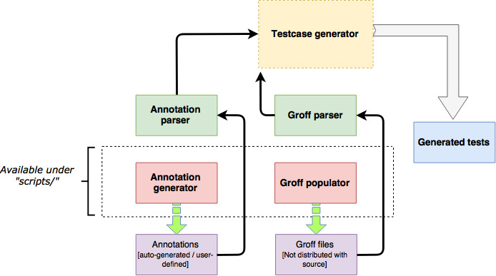

# Smoke testing of base utilities (FreeBSD)

Test generation tool made as a part of [Google Summer of Code '17 with FreeBSD](https://summerofcode.withgoogle.com/projects/#6426676740227072).  
**Refer the [FreeBSD wiki](https://wiki.freebsd.org/SummerOfCode2017/SmokeTestingOfBaseUtilities) for an overview and updates.**

## Project layout
```
├── deprecated_tests
│   └── ............................:: Tests pertaining to initial test plan
└── src ............................:: Automation tool pertaining to new test plan
    ├── annotations
    │   └── ........................:: Annotation files (generated/user-defined)
    ├── generated_tests
    │   └── ........................:: Generated atf-sh test scripts
    ├── scripts
    │   └── ........................:: Helper scripts
    ├── add_testcase.cpp ...........:: Testcase generator
    ├── generate_license.cpp .......:: Customized license generator
    ├── generate_test.cpp ..........:: Test generator
    ├── logging.cpp ................:: Logger
    ├── read_annotations.cpp .......:: Annotation parser
    └── utils.cpp ..................:: Index generator
```

## Automation tool
An implementation of the automation tool briefly described here [[1]](https://lists.freebsd.org/pipermail/soc-status/2017-July/001079.html)[[2]](https://shivansh.github.io/assets/tmp/smoke_testing_mail.pdf).  
The following diagram summarizes how different components fit with the testcase-generator -  



- - -

## Dependencies
* Boost C++ libraries : The tool was tested to work with the port `boost-all-1.64.0`.
* [Kyua](https://github.com/jmmv/kyua/)

## Instructions
* The tool needs to know about the utilities in src which don't already have tests. The list of all such utilities can be generated via -  
  ```
  make fetch_utils
  ```
  This will generate the file `scripts/utils_list`.

* For generating the tests, execute the following -  
  ```
  make clean
  make && make run
  ```

A few demo tests are located in [src/generated_tests](src/generated_tests).
